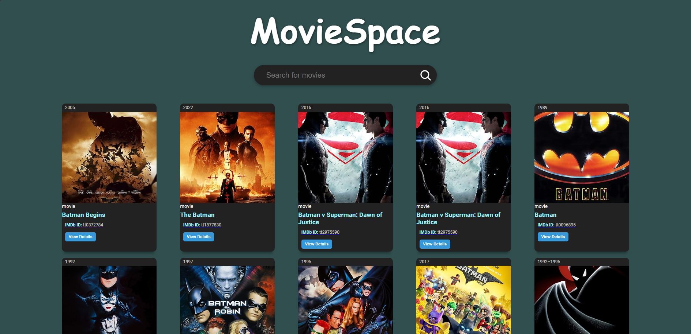
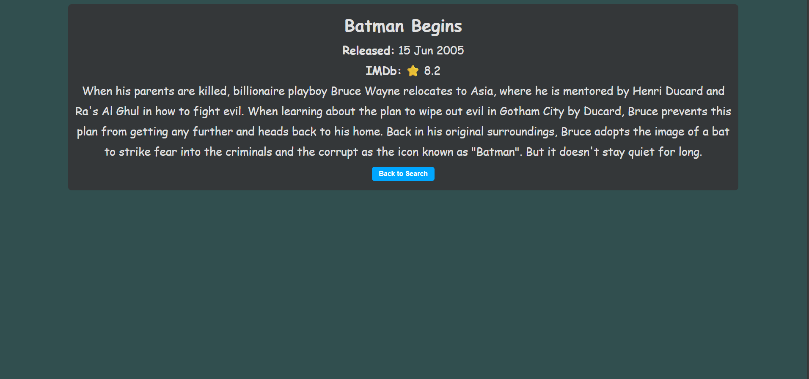

# 🎬 MovieSpace — React + OMDb

A simple, responsive movie search app built with **React + Vite** and the **OMDb API**. Users can search movies, explore details, and navigate seamlessly with React Router.

## 🚀 Live Demo  
[https://earnest-lolly-78a506.netlify.app/](https://earnest-lolly-78a506.netlify.app/) 

---

## ✨ Features

* 🔎 Search movies by title
* 🖼️ Posters, titles, IMDb IDs, ratings, and release years
* 📜 Expandable movie descriptions (full plot view)
* 🚦 Loading states and graceful error handling
* 📱 Responsive UI
* 🧭 Routing (Home, Movie Detail, 404 Not Found)

---

## 🧰 Tech Stack

* React + Vite
* React Router DOM
* Fetch API
* CSS (custom styles)

---

## 🚀 Getting Started

### Prerequisites

* Node.js **18+** and npm
* A free **OMDb API** key ([http://www.omdbapi.com/apikey.aspx](http://www.omdbapi.com/apikey.aspx))

### 1) Clone & Install

```bash
git clone https://github.com/Avi2909/moviespace.git
cd moviespace
npm install
```

### 2) Environment Variables

Create a `.env` file in the project root:

```bash
VITE_OMDB_API_KEY=f44bcaf8
VITE_OMDB_BASE_URL=https://www.omdbapi.com
```

> Ensure `.env` is in `.gitignore`. A sample `.env.example` can be shared in the repo.

### 3) Run Locally

```bash
npm run dev
```

Open: `http://localhost:5173`

### 4) Build & Preview

```bash
npm run build
npm run preview
```

---

## 🔑 API Reference (OMDb)

Base URL: `https://www.omdbapi.com`

All requests require `apikey=YOUR_KEY` (replace with your OMDb API key).

### Search by Title

```
GET /?apikey=YOUR_KEY&s=batman
```

Example: [Search Batman](http://www.omdbapi.com/?apikey=YOUR_KEY&s=batman)

### Get Movie Details by IMDb ID

```
GET /?apikey=YOUR_KEY&i=tt0372784&plot=full

```

Example: [Details](http://www.omdbapi.com/?apikey=YOUR_KEY&i=tt0372784&plot=full)

---

## 🗂️ Project Structure

```
moviespace/
│── public/
│── docs/
│   ├── screenshot-home.png
│   ├── screenshot-details.png
│── src/
│   ├── App.css
│   ├── App.jsx
│   ├── main.jsx
│   ├── MovieCard.jsx
│   ├── pages/
│   │   ├── Home.jsx
│   │   ├── MovieDetail.jsx
│   │   └── NotFound.jsx
│── .env.example
│── package.json
│── README.md

```

---

## 📸 Screenshots

| Home Page | Movie Details |
|-----------|---------------|
|  |  |

---

## 🐛 Troubleshooting

* **Invalid API key** → verify `VITE_OMDB_API_KEY`
* **No results** → refine search term
* **CORS/Network error** → check connectivity or proxy settings

---

## 📄 License

MIT © Avnish Dwivedi

---

## 👤 Author

* Avnish Dwivedi
* GitHub: [@Avi2909](https://github.com/Avi2909)

## 🙏 Acknowledgements

* Data powered by [OMDb API](http://www.omdbapi.com)
